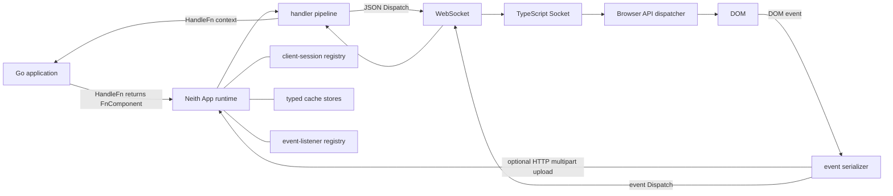
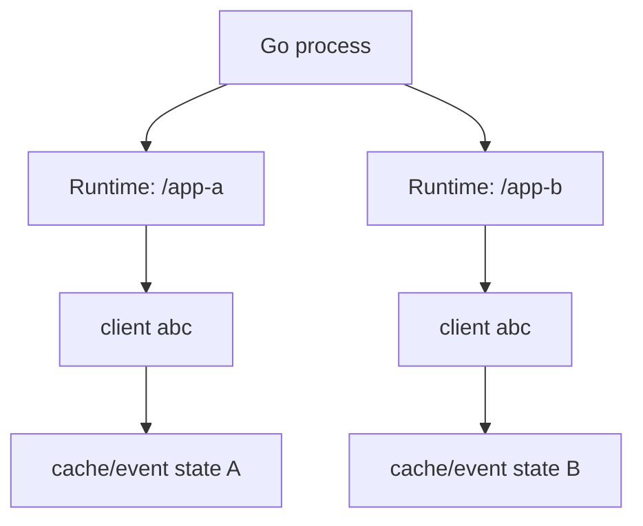
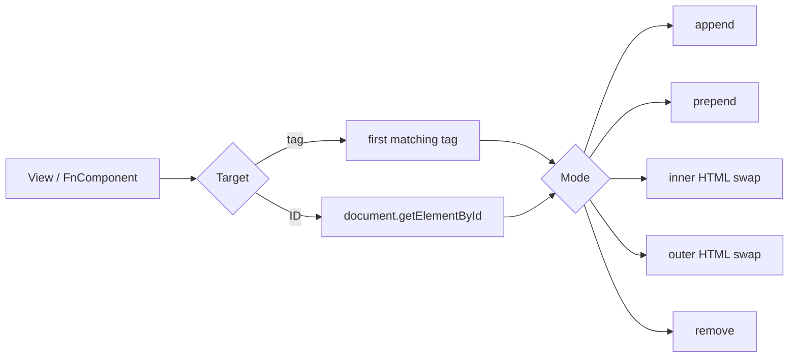
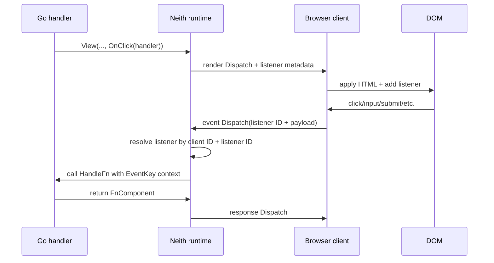
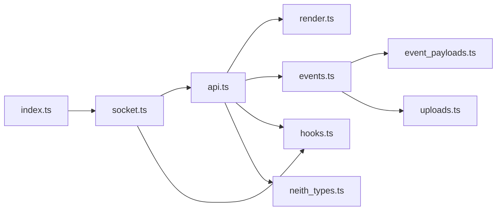

# Architecture

Neith is a Go-first, server-rendered UI interaction layer. The server owns rendering, event handlers, per-client state, and the authoritative dispatch protocol. A small TypeScript browser runtime owns the WebSocket transport, applies server instructions to the DOM, serializes browser events, and uploads files before event dispatch when necessary.

## High-level system



The code is intentionally split across two runtimes while using one protocol. `dispatch.go` and `dispatch_payloads.go` define the Go message contract; `static/assets/neith_types.ts` mirrors that contract in the browser.

## Server architecture

### `App` and page shell

`App(hf, opts...)` builds a `Page`, creates a fresh Neith runtime through `MiddleWareFn`, and returns an `http.HandlerFunc`. The resulting handler has three responsibilities:

- serve the requested HTML document when no `neith_id` is present;
- serve the embedded browser bundle and neutral stylesheet when their asset paths hit the same handler;
- upgrade requests carrying `neith_id` to a WebSocket and start the interactive session.

`Page` is a normal Neith `Component`, so the default shell is generated by Go rather than a template file. `NewPage` defaults to a `<main>` target, English language, `/assets/neith-ui.css`, and `/assets/neith.min.js`. Page options customize title, language, target tag/ID/classes, scripts, stylesheets, head components, body components, and inline style.

### Runtime isolation

Every call to `MiddleWareFn` creates a `runtime` with its own:

- `handlerPool`;
- `clientSessionRegistry`;
- `eventListeners` registry;
- cache `storeManager`;
- cache callback/history registry;
- configuration pointer.

This is a critical boundary. Two separately mounted Neith applications do not share sessions, event listeners, or cache stores merely because they use the same process or the same browser-generated client ID.



### Client sessions versus WebSocket connections

A `clientSession` is identified by the browser's `neith_id`. It can outlive an individual `*websocket.Conn`.

When a connection attaches:

1. the runtime looks up or creates the session;
2. the new `conn` becomes `activeConn`;
3. any previous connection for that same client ID is closed;
4. event and cache state continue to belong to the session/runtime.

When a connection closes, it is detached. A delayed cleanup waits for `Config.CacheTimeOut`; if the session has not reconnected, the session registry entry and cache store are removed. This is why a short transport interruption can preserve state while a truly abandoned client eventually releases it.

### Handler pipeline

Each runtime handler has buffered `in` and `out` channels. Incoming WebSocket dispatches are decoded by `conn.readLoop`, resolved to a handler through `HandlerID`, and placed on the handler's input channel. The handler routes input operations such as `ping`, `event`, and `custom`.

Outgoing `FnComponent` values are routed through the output channel by dispatch function:

- `render` -> server-rendered HTML;
- `class` -> class-list mutation;
- `dom` -> focused DOM operation;
- `redirect` -> browser navigation;
- `custom` -> named browser JavaScript call;
- `error` -> server logging path;
- `ping` -> liveness handshake.

The connection write loop serializes transport access through a buffered message channel. `Publish` additionally checks that the connection is still the session's active connection so a stale WebSocket does not continue writing after a reconnect supersedes it.

## Component and rendering model

`Component` is deliberately tiny:

```go
type Component interface {
    Render(ctx context.Context, w io.Writer) error
}
```

This shape is compatible with `templ` components and trivial custom renderers. `neith.HTML` is the raw-string adapter; `RenderComponent` renders components without a live dispatch connection.

`NewFn(ctx, component)` creates an `FnComponent` with a unique `neith-<uuid>` wrapper ID. It copies dispatch details from Neith middleware context when present, renders the supplied component into an internal buffer, and defaults to replacing the inner HTML of the first `<main>` element.

`View` is the preferred readable layer over `NewFn`. Its options transform the underlying `FnComponent` without creating a second rendering model.

### Render targeting

A render dispatch targets either the first element matching a tag or one element by ID. Modes are append, prepend, inner swap, outer swap, or removal.



The browser applies the operation, scans the inserted subtree for serialized listener metadata, attaches DOM listeners, and emits before/after render hooks.

## Dispatch protocol

`Dispatch` is the transport envelope. Its `function` field selects which nested payload is meaningful.

| Function | Go payload | Browser behavior |
| --- | --- | --- |
| `ping` | `FnPing` | Marks client response and returns the dispatch. |
| `render` | `FnRender` | Applies HTML by target/mode and wires event listeners. |
| `class` | `FnClass` | Adds/removes CSS classes from a target ID. |
| `dom` | `FnDOM` | Applies a focused attribute/style/text/value/focus-style operation. |
| `redirect` | `FnRedirect` | Sets browser location to the supplied URL. |
| `event` | `EventListener` | Browser-to-server event invocation. |
| `custom` | `FnCustom` | Calls `window[function](data)` and returns the result. |
| `error` | `FnError` | Carries protocol/client errors to the server error path. |

`FnRender` also transports event listener metadata. The server wrapper serializes listeners into an `events` attribute; the browser parses that metadata after insertion.

## Event lifecycle

Attaching `OnClick`, `OnSubmit`, `On`, or `WithEvents` creates an `EventListener` with a UUID and registers it against the current client connection/session. The rendered wrapper contains the listener metadata but not the Go function itself.



The browser captures a JSON-safe `EventTarget` snapshot. Typed event payloads exist for pointer, mouse, keyboard, drag, touch, and form-data events. `EventData[T]` re-marshals the stored payload into an application-selected Go type. `EventSubmitter` exposes the button/input responsible for form submission.

## Upload lifecycle

Files are not placed directly into WebSocket JSON. The browser uploads selected files to the same Neith endpoint using multipart HTTP with `neith_upload=1`, receives `Upload` metadata, then includes that metadata in the event dispatch.

Server defaults are:

- maximum request body: 64 MiB;
- multipart in-memory threshold: 32 MiB;
- storage directory: `${TMPDIR}/neith-uploads` unless `Config.UploadDir` is set;
- upload directory mode: `0700`;
- individual file mode: `0600`.

Stored filenames are prefixed with a generated upload UUID and normalized with `filepath.Base` before joining the upload directory. Neith returns metadata and leaves lifecycle/deletion policy for saved files to the host application.

## Cache architecture

`Cache[T]` is typed state scoped by `(runtime, client session ID, cache key)`. The outer `storeManager` owns one `cacheStore` per client ID; each store owns arbitrary typed entries.

`NewCache` refuses duplicate keys, including duplicates created with another Go type. `UseCache[T]` distinguishes missing entries from type mismatches. `Set` updates timestamps, resolves the timeout, persists the value, triggers change callbacks/history, and starts an expiry watcher.

Each expiry watcher remembers the `updatedAt` value that created it. If a later `Set` changes that timestamp, the stale watcher exits rather than deleting a newer value. This allows each update to start a simple goroutine without making old timers authoritative.

Optional cache history and callback maps live in the runtime-level `cacheEventRegistry` and use a combined session/key identifier to stay isolated.

## Browser architecture

The browser entrypoint (`static/assets/index.ts`) simply creates `new Socket()`. The imported modules divide responsibilities:



`Socket` derives a same-origin `ws:` / `wss:` URL, persists a generated client key in `localStorage` under `neith`, reconnects unexpected disconnects with capped exponential backoff (500 ms base, 30 s maximum), and emits connection lifecycle hooks.

`API` dispatches incoming operations to render/class/DOM/custom handlers and sends any returned dispatch back over the socket. Client-side failures are converted into protocol error dispatches so they can be observed server-side.

## Generated and embedded assets

The TypeScript entrypoint is bundled and minified into `static/assets/neith.min.js`. `page.go` embeds that file plus `static/assets/neith-ui.css` using `go:embed`, so they ship inside the Go package binary.

Other generated or derived files should not be edited directly:

- `examples/readme-setup/dashboard_templ.go` is generated from `dashboard.templ`;
- `static/assets/neith.min.js` is generated from TypeScript sources;
- `static/assets/stylesheets/tailwind.min.css` is generated from Tailwind input;
- compiled Sass outputs/source maps are build products where populated.

## Concurrency and ownership

Neith uses mutexes around runtime registries and stores, channels around handler/connection dispatch, and goroutines for read/write loops, pings, event processing, and cache expiry. Important ownership rules are:

- one active WebSocket per `(runtime, client ID)`;
- handler IDs belong to one runtime;
- event listeners are resolved inside the runtime and client scope;
- cache stores are keyed by client ID inside one runtime;
- only the active connection may publish to a session;
- user cache callbacks run after registry locks are released.

## Security boundaries and operational cautions

The current WebSocket upgrader accepts every origin (`CheckOrigin` returns true). Applications exposed to untrusted origins should place Neith behind an origin/authentication policy appropriate to their deployment rather than assuming the package enforces one.

The browser client ID is a convenience session key generated in JavaScript and stored in `localStorage`; it is not an authentication credential. Authentication and authorization belong to the host application.

`FnComponent.JS` / `neith.JS` deliberately call a named function on `window`. Treat the function name and payload as trusted application-controlled data.

Uploaded files are persisted on the server and are not automatically deleted when their associated event completes. Hosts should validate content according to their domain and implement retention/deletion policy when uploads are enabled.