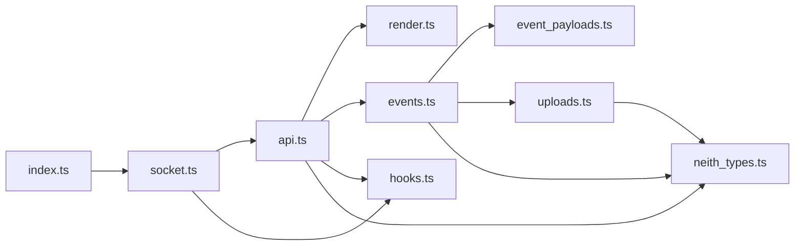
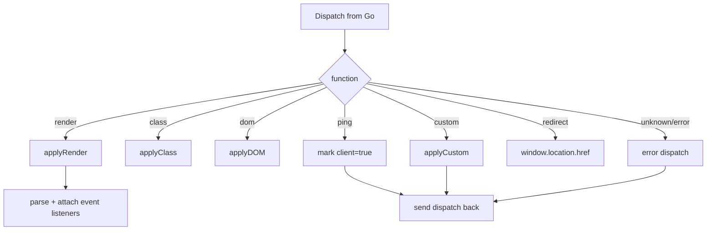

# Browser Client

Neith's browser runtime lives in `static/assets/`. It is written in TypeScript and bundled from `index.ts` into `neith.min.js`. The browser is intentionally thin: the Go server remains responsible for rendering and handler logic; the client owns transport, DOM application, event capture, upload transport, and lifecycle hooks.

## Module map



| Module | Responsibility |
| --- | --- |
| `index.ts` | Bundle entrypoint; creates the `Socket` immediately. |
| `socket.ts` | WebSocket URL, persistent client key, connection lifecycle, reconnect backoff, message handoff. |
| `api.ts` | Dispatch router for render/class/DOM/custom/ping/redirect and error reporting. |
| `render.ts` | Applies server instructions to the DOM and calls custom browser functions. |
| `events.ts` | Parses serialized listener metadata, attaches native DOM listeners, and emits event dispatches. |
| `event_payloads.ts` | Converts browser-native event objects and element targets into JSON-safe protocol payloads. |
| `uploads.ts` | Extracts form values and posts file bytes over multipart HTTP before event dispatch. |
| `hooks.ts` | Lifecycle-hook registry and public `window.neith` hook API. |
| `neith_types.ts` | TypeScript mirror of the Go dispatch envelope and payload types. |
| `tests/index.test.ts` | jsdom/Jest integration coverage for dispatch, rendering, events, uploads, reconnects, hooks, and DOM operations. |

## Startup

The browser bundle starts with:

```ts
new Socket();
```

`Socket` derives the endpoint from the current page:

- HTTPS page -> `wss:`;
- other page protocol -> `ws:`;
- same host and page path;
- `?neith_id=<client-key>` query parameter.

A client key is generated once and stored in `localStorage` under `neith`. It is reused across reloads and reconnects. This key is a Neith session/transport identifier only; it is not an authentication token.

## Connection lifecycle

`Socket` owns the active `WebSocket` and creates a new `API` object for every connection. On the first successful open it emits `connect`; later successful opens emit `reconnect`.

Unexpected disconnects are retried using capped exponential backoff:

```text
base delay: 500 ms
maximum:    30 seconds
```

Close codes 1000 and 1001, and clean closes, are treated as intentional and are not retried. Only one reconnect timer may exist at a time, and a successful open resets the attempt counter.

This transport behavior aligns with the server's client-session model: a reconnect sends the same `neith_id`, causing the new socket to replace the session's prior active connection while allowing session-scoped state to survive until timeout.

## Server-to-browser dispatch

`Socket.onmessage` parses JSON as a `Dispatch` and passes it to `API.Process`.



Operations that produce a response are serialized back through the same WebSocket. DOM-only operations normally return no response.

### Render

The render payload chooses a target by either tag name or element ID and a mode of append, prepend, inner replacement, outer replacement, or removal. After applying HTML, the client scans the inserted element/subtree for Neith listener metadata and wires the represented native browser events.

The client emits `beforeRender` before the mutation and `afterRender` after the listener pass.

### Class and focused DOM operations

Class dispatches add or remove the supplied names from a target element's `classList`.

DOM dispatches are the imperative complement to server rendering. They support focused changes represented by `FnDOM.Operation`, including attribute/style/text/value operations, focus/blur, state changes, scrolling, and removal where implemented by `render.ts`.

Use these for small mutations. Structural UI should normally be server-rendered and sent through `render` so the DOM remains aligned with Go output.

### Redirect

A redirect dispatch directly assigns `window.location.href` to the server-provided URL. It intentionally leaves the current Neith page and does not produce a WebSocket reply.

### Custom JavaScript

A custom dispatch identifies a function name and argument. The browser calls the corresponding global function and places the result back into the custom payload before responding to Go.

Application code should treat this as an explicit escape hatch: keep function names server/application controlled and expose only the global functions the application intends Neith to call.

## Event listeners

When Go renders an `FnComponent` with events, its wrapper contains serialized event-listener metadata. The browser client parses that metadata and attaches matching native event listeners.

An event dispatch keeps the listener/handler identity needed by Go and adds a JSON-safe payload describing the native event and relevant DOM target state.

The server can then decode that payload using `EventData[T]`.

## Event target snapshots

The TypeScript payload builder mirrors Go's `EventTarget` type. Target snapshots can include:

- `id`, `name`, tag name, and classes;
- `innerHTML` and `outerHTML`;
- form-control value and selected options;
- checked, disabled, and hidden state;
- inline style;
- attributes and dataset values.

Pointer, mouse, keyboard, drag, and touch payloads also include event-specific coordinates/modifiers and both the event `source` and Neith `component` target where applicable.

Keep in mind that these are browser-reported values. They are convenient event data, not a security boundary; validate privileged actions on the server.

## Forms and submitters

For normal form fields, `uploads.ts` creates `FormData` and converts non-file values into a plain object. File entries are deliberately omitted from that object because bytes travel over a separate upload request.

When a submitter button/input is known, its name/value pair is included. The implementation supports environments that accept `new FormData(form, submitter)` and falls back to appending the submitter manually when necessary.

Go handlers can inspect ordinary values through `EventData` and the exact submit control through `EventSubmitter`.

## File uploads

Before a form event is sent over WebSocket, selected files are collected from named `<input type="file">` controls and uploaded using `fetch` with multipart `FormData`.

The upload URL is the current page URL with:

```text
neith_upload=1
neith_id=<localStorage client key>   # when available
```

The server returns a JSON list of `Upload` metadata. The client attaches that metadata to the subsequent event dispatch; Go reads it with `EventUploads(ctx)`.

This split keeps WebSocket messages small and JSON-only while leaving HTTP to handle file bytes and request-size limits.

## Lifecycle hooks

`hooks.ts` exposes these hook names:

```text
connect
disconnect
reconnect
beforeRender
afterRender
beforeEventDispatch
afterEventDispatch
error
```

The public API is installed on `window.neith`:

```js
const stop = window.neith.on("afterRender", ({ element, dispatch }) => {
  console.log("rendered", element, dispatch);
});

// later
stop();
```

Equivalent registration is available through `window.neith.hooks.on/off`. `on` returns an unsubscribe function.

Hook payloads are intentionally sparse: render hooks may include a dispatch and element, event hooks may include the native event, and error hooks may include an error string.

## Error handling

Browser-side protocol failures are converted into Neith `error` dispatches rather than existing only as thrown console errors. The `error` hook fires before the dispatch is sent back to Go.

Socket construction/API setup errors still throw because the browser runtime cannot proceed without those primitives.

## Type contract

`neith_types.ts` is the browser mirror of:

- `Dispatch` in `dispatch.go`;
- `FnRender`, `FnPing`, `FnClass`, `FnDOM`, `FnRedirect`, `FnCustom`, and `FnError` in `dispatch_payloads.go`;
- event/upload payloads in `event_types.go` and `event_listener.go`.

When changing the wire contract, update Go and TypeScript together and extend both Go tests and `static/assets/tests/index.test.ts`.

## Building the bundle

The Makefile expects TypeScript compilation plus esbuild bundling:

```sh
make bundle
```

which bundles `static/assets/index.ts` into:

```text
static/assets/neith.min.js
```

`make assets` additionally rebuilds TypeScript, Tailwind output, and Sass outputs according to the repository toolchain.

Do not hand-edit `neith.min.js`; it is a derived artifact and is embedded into Go by `page.go`.

## Browser tests

From the repository root:

```sh
cd static/assets
npm install
npm test
```

The package uses Jest with a DOM test environment. Browser tests should cover protocol changes from the user's point of view: resulting DOM, WebSocket replies, lifecycle hooks, upload requests, event payloads, and reconnect behavior rather than only private helper implementation.