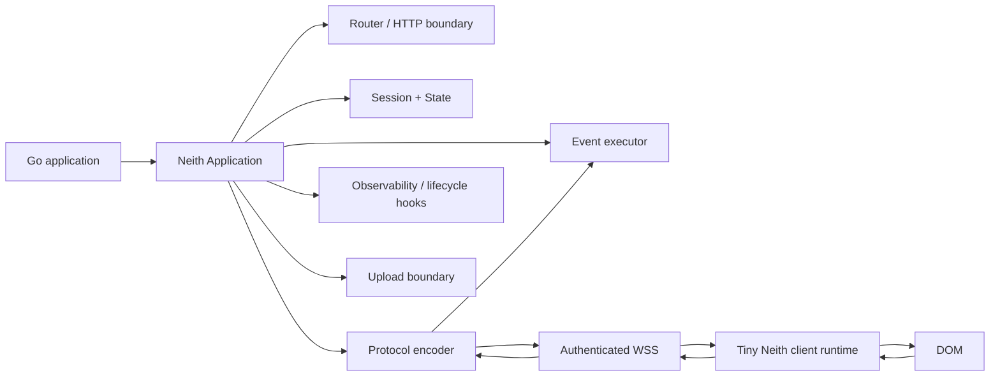

# Neith Development Plan 0926-1

Status: active framework direction
Date: 2026-09-10
Branch: `dev`
Target: pre-1.0 framework hardening and developer-experience redesign

## 1. Purpose

Neith is moving from a capable server-rendered interaction library into a deliberate Go web framework for building interactive applications without turning the browser into the application runtime.

The framework thesis is:

> Write ordinary Go. Render ordinary components. Neith handles interactivity.

Neith should remain recognizably Go: explicit, inspectable, composable with `net/http`, renderer-agnostic, and free of hidden application magic. The browser should not run a second application architecture. It should execute a small, secure, versioned UI protocol directed by the Go server.

This plan incorporates the architectural and procedural decisions discussed on 2026-09-10 and organizes them into a development sequence suitable for incremental implementation before 1.0.

## 2. Design goals

Neith 1.0 should be:

- human-readable in ordinary application code;
- small enough that a developer can understand the core mental model quickly;
- idiomatic with standard Go HTTP infrastructure;
- server-authoritative for rendering, state, events, authorization, and application behavior;
- renderer-agnostic, with excellent `templ` compatibility but no mandatory template engine;
- secure by default at the WebSocket and upload boundaries;
- deterministic about event ordering and application lifecycle;
- versioned at the browser protocol boundary;
- observable and debuggable in development;
- explicit about public, advanced, and internal APIs;
- documented around one canonical workflow instead of multiple equally-prominent styles;
- continuously indexed in Grapher so implementation, decisions, invariants, docs, and tests remain connected.

## 3. Non-goals

Before 1.0, Neith should not become:

- an ORM or database framework;
- a dependency-injection container;
- a React clone or hook-based client state framework;
- a large component design system;
- an arbitrary JavaScript remote-execution platform;
- a replacement for `net/http`, Chi, Echo, or other host HTTP infrastructure;
- a generator that creates large opaque project structures;
- a client-side SPA framework with Go merely acting as an API.

## 4. Core architectural principle

The target system should look like this:



The browser runtime is not a second framework. It is a trusted interpreter for a finite Neith protocol.

Application behavior remains in Go.

## 5. Framework API direction

### 5.1 Introduce a first-class `Application`

Package-global configuration should no longer be the primary architecture.

Target shape:

```go
app := neith.New(
    neith.WithLogger(logger),
    neith.WithSessionTimeout(30*time.Minute),
)

app.Route("/", home)
app.Route("/settings", settings)

log.Fatal(http.ListenAndServe(":8080", app))
```

`Application` should own:

- runtime configuration;
- route registration;
- session registry;
- state stores;
- event registry/executor;
- protocol version/policy;
- WebSocket upgrade/security policy;
- upload policy;
- lifecycle hooks;
- logging and diagnostics;
- graceful shutdown.

The current `neith.App(...)` convenience function may remain as a small compatibility wrapper over `Application`.

### 5.2 Keep `net/http` foundational

A Neith application should implement `http.Handler` and compose naturally with normal Go middleware. Host applications must remain able to use existing authentication, routing, tracing, compression, recovery, and reverse-proxy patterns.

Neith should not invent an alternate request/response universe.

### 5.3 Establish one canonical application API

Application-facing documentation should prefer:

- `Application`;
- `View`;
- `Component`;
- `Event` accessors;
- `State`;
- concise render-target operations.

Low-level protocol and transport types should become advanced/internal implementation APIs.

### 5.4 Simplify render targeting

The current tag/element × append/prepend/inner/outer vocabulary is precise but too broad for the primary API.

Preferred high-level vocabulary:

```go
neith.Into("#profile")
neith.Append("#messages")
neith.Prepend("#notifications")
neith.Replace("#card")
neith.Remove("#modal")
```

Selectors should be validated in development mode. Existing explicit primitives may remain temporarily as compatibility or advanced helpers.

### 5.5 Reduce aliases before 1.0

Avoid teaching multiple names for the same operation. In particular, decide on one canonical naming style for events, targets, and handlers.

Candidates for cleanup/renaming include:

- `MiddleWareFn`;
- `FnComponent`;
- `HandleFn`;
- `FnRender` / `FnDOM` naming;
- `Click` versus `OnClick` aliases;
- duplicate render-target helper families.

The public API should be boring, obvious, and searchable.

## 6. State model

### 6.1 Promote `Cache[T]` into `State[T]`

The existing generic cache is semantically application/session state, not merely a performance cache.

The developer-facing concept should become `State[T]` or an equivalently explicit state primitive while preserving the proven implementation behaviors:

- typed values;
- per-session isolation;
- duplicate-key protection;
- expiration;
- stale-expiry protection;
- callbacks;
- optional history.

### 6.2 Add explicit scopes

Target state scopes:

- request;
- session;
- application.

Persistent/user-backed state should remain adapter territory rather than being built into the core.

### 6.3 Make reconnect behavior contractual

Temporary WebSocket replacement must not implicitly destroy a Neith session. The framework should explicitly guarantee state retention for reconnects within the configured session timeout.

This guarantee requires integration tests covering connection replacement, stale-socket writes, reconnect state retention, timeout cleanup, and route/application isolation.

## 7. Event execution model

### 7.1 Define ordering

The current goroutine-per-operation behavior can produce ordering ambiguity when one client generates multiple events rapidly.

Target rule:

> Events for one Neith session execute serially by default. Separate sessions may execute concurrently.

Explicit asynchronous work may be added later, but ordering should not depend on scheduler timing.

### 7.2 Cancellation

Handler contexts should support cancellation for:

- application shutdown;
- abandoned session where appropriate;
- superseded operations where explicitly defined;
- upstream HTTP/request cancellation where meaningful.

### 7.3 Human-readable event access

Retain `context.Context` underneath, but provide a coherent developer-facing event/request abstraction so application code does not feel like repeated extraction from hidden context keys.

The API should make the following obvious:

- current request;
- current session;
- event payload;
- submitter;
- uploads;
- scoped state;
- cancellation/deadline.

Go generic-method limitations should be respected; do not force a clever API that fights the language.

## 8. Browser runtime redesign

### 8.1 Target: tiny trusted protocol interpreter

The browser bundle should contain only generic capabilities required to execute Neith's finite UI protocol.

Conceptual responsibilities:

```text
CONNECT
AUTHENTICATE / NEGOTIATE
RECEIVE
VALIDATE
EXECUTE
OBSERVE
SEND
RECONNECT
```

Application behavior must not be preloaded into the browser runtime.

### 8.2 Collapse browser operations

The current `API` dispatch table is already close to an instruction interpreter. Refactor it toward a smaller primitive instruction set rather than a growing collection of one-off JavaScript functions.

Candidate protocol primitives:

- `render`;
- `mutate`;
- `listen`;
- `navigate`;
- `upload`;
- `ping`;
- `error`.

A `mutate` command may batch operations such as class changes, attributes, styles, text/value changes, focus/blur, and element removal.

Example:

```json
{
  "v": 1,
  "type": "mutate",
  "target": "#email",
  "operations": [
    {"op": "attribute.set", "name": "aria-invalid", "value": "true"},
    {"op": "class.add", "value": "error"},
    {"op": "focus"}
  ]
}
```

This lets the server compose UI effects while the client owns only generic DOM primitives.

### 8.3 Do not dynamically ship arbitrary JavaScript

"Not preloaded" means no application behavior is preloaded. It does not mean sending executable JavaScript over the socket.

Forbidden architecture:

- `eval`;
- `new Function`;
- arbitrary JS source execution from protocol messages;
- unrestricted property traversal/execution;
- a generic `exec` message.

WSS protects transport confidentiality/integrity; it does not make arbitrary remote code execution safe.

### 8.4 Constrain or retire `custom`

The current named `window[...]` custom-function escape hatch should not become the center of the framework.

Options, in preference order:

1. replace common use cases with supported protocol primitives;
2. retain a tightly allowlisted application extension registry;
3. explicitly mark custom browser extensions as advanced/unsafe-by-default territory.

Never evolve `custom` into server-supplied source evaluation.

## 9. Versioned protocol

### 9.1 Replace implicit function dispatch with a versioned envelope

Target shape:

```json
{
  "v": 1,
  "type": "render",
  "payload": {}
}
```

The message type should determine the allowed payload shape.

### 9.2 Single protocol source of truth

Go and TypeScript protocol definitions should no longer be manually maintained as independent authorities.

Choose one of:

- generate TypeScript definitions from a Go/schema source;
- generate both from a neutral schema;
- mechanically validate one against the other in CI.

The goal is impossible-to-ignore drift detection.

### 9.3 Contract tests

CI must verify representative messages end-to-end:

- Go encoding -> browser decoding/execution;
- browser event encoding -> Go decoding;
- version negotiation;
- malformed/unknown messages;
- unsupported protocol versions;
- batched mutations;
- reconnect negotiation.

Protocol changes are release-significant changes.

## 10. WebSocket and session security

### 10.1 Secure transport boundary

Production behavior should use `wss:` whenever HTTPS is active and enforce an explicit server-side origin policy.

The current permissive origin behavior must not survive as the default production posture.

### 10.2 Server-issued session identity

A browser-generated localStorage UUID is useful as a prototype transport key but should not be treated as identity or trusted session authority.

Target design:

- server-issued opaque session identifier;
- secure cookie-based transport where appropriate;
- `Secure`, `HttpOnly`, and suitable `SameSite` policy;
- configurable session provider/strategy;
- no authorization decisions based solely on browser-supplied Neith identifiers.

### 10.3 Upgrade authentication

Normal host authentication and authorization should be evaluated before or during WebSocket upgrade. Neith should expose clear hooks/policy without becoming an auth product.

### 10.4 Message hardening

Add configurable limits for:

- WebSocket frame/message size;
- upload body size;
- multipart memory;
- event payload size;
- listener/message frequency where practical.

Unknown operations, malformed payloads, unsupported versions, and unauthorized operations must fail closed.

### 10.5 Upload boundary

The HTTP upload path must share the same session/auth model as the WebSocket path and enforce origin/CSRF protections appropriate to the chosen session strategy.

Application-owned validation, retention, quarantine, and deletion remain explicit responsibilities.

## 11. Internal package architecture

Move implementation machinery behind a stable public boundary before 1.0.

Suggested conceptual ownership:

```text
neith/
  application + public component/event/state API

internal/
  runtime/
  protocol/
  transport/
  session/
  events/
  state/
  upload/
  client-contract/
```

Exact directories may differ, but ownership should be clear.

`handler.go` should not remain the long-term home for middleware creation, event scheduling, pinging, render routing, custom dispatch, and transport orchestration simultaneously.

## 12. Lifecycle and observability

### 12.1 Application lifecycle

Provide explicit application lifecycle support:

- startup;
- graceful shutdown;
- session connect;
- reconnect;
- disconnect;
- session expiry;
- event start/finish;
- render start/finish;
- protocol error;
- upload lifecycle.

### 12.2 Development diagnostics

Development mode should become a framework differentiator.

A useful diagnostic overlay should expose, without leaking production secrets:

- route;
- connection status;
- session identifier in redacted/development form;
- last event type;
- last render target/mode;
- render/event duration;
- active state keys/types;
- protocol version;
- client/server errors;
- reconnect attempts.

### 12.3 Target validation

In development mode, missing render/mutation targets should produce explicit diagnostic errors containing the selector and operation rather than silent failures.

## 13. Forms and typed input

Forms are a primary server-driven-framework workflow and should receive a deliberate API.

Provide a coherent path for:

- binding submitted values;
- validation;
- field-specific errors;
- submitter/action detection;
- file metadata/uploads;
- redisplaying entered values;
- rerendering form regions.

Investigate a typed `Bind[T]`-style helper or equivalent that remains idiomatic Go and does not obscure validation behavior.

The framework should make ordinary CRUD forms pleasant without requiring developers to hand-decode maps repeatedly.

## 14. Error model

Create one obvious application error path.

Framework support should include:

- default error handler/renderer;
- route/application override;
- structured logging hook;
- development stack/context diagnostics;
- production-safe user output;
- protocol errors distinct from application errors;
- transport/session errors distinct from application errors.

`FnErr` may remain as a compatibility mechanism but should not define the long-term developer mental model.

## 15. Optional UI package

Keep `ui` optional and deliberately small.

Neith core owns interaction architecture, not visual design. The UI package may provide neutral semantic primitives, but it must not become required for framework behavior.

If it grows substantially, split it into a companion module/package with clear independence from the runtime.

## 16. CLI strategy

A CLI is useful later, but only after the public framework model stabilizes.

Potential commands:

```text
neith new
neith dev
neith doctor
neith build
neith version
```

`neith new` should generate a boring project that can be understood in minutes. Prefer a tiny shape such as:

```text
main.go
views/
static/
go.mod
```

Avoid large generated scaffolds and framework-owned project bureaucracy.

## 17. Documentation strategy

### 17.1 One canonical learning path

Documentation should teach one primary style first:

1. create an application;
2. register routes;
3. render components with `View`;
4. bind events;
5. use scoped state;
6. update a target;
7. handle forms/uploads;
8. deploy securely.

Lower-level `FnComponent`, transport, protocol, raw dispatch, and extension internals belong in advanced/reference documentation.

### 17.2 Canonical examples

Maintain three tested examples rather than a large sample graveyard:

- fundamentals: counter/todo-sized application;
- CRUD/forms: typed input, validation, state, uploads;
- realtime dashboard: reconnect, state retention, server-driven updates, diagnostics.

Examples are release artifacts and must be exercised in CI.

### 17.3 Human-readable reference

Every exported public symbol should have:

- concise Go doc;
- one obvious purpose;
- naming consistent with the canonical vocabulary;
- reference linkage from the usage guide when appropriate.

## 18. ADR process

Create `docs/adr/` and record irreversible or high-cost architectural choices.

Initial ADR set should cover:

1. Go/server ownership of application behavior;
2. browser as finite protocol interpreter;
3. no arbitrary JavaScript execution over transport;
4. first-class `Application` runtime ownership;
5. session/state scope and reconnect guarantee;
6. per-session serial event execution;
7. versioned protocol and compatibility policy;
8. renderer neutrality and `net/http` compatibility;
9. secure origin/session upgrade defaults;
10. public/internal API boundary.

ADRs should describe context, decision, consequences, alternatives, and implementation references.

## 19. Grapher requirements

Grapher remains part of the development process, not a one-time repository inventory.

For framework work, Grapher should model:

- architectural invariants;
- ADR decisions;
- public API concepts;
- protocol operations;
- runtime ownership;
- session/state guarantees;
- security boundaries;
- test coverage relationships;
- deprecated/replacement APIs;
- documentation dependencies.

Every substantive framework PR/commit should update affected graph nodes and relationships before it is considered complete.

File-level indexing remains required, but conceptual/decision relationships are the higher-value layer.

## 20. CI and contribution gates

CI should become invariant-aware.

Required gates as relevant to a change:

- `go test ./...`;
- browser test suite;
- race tests for runtime/session/state changes;
- protocol contract tests for protocol/browser changes;
- generated asset freshness check;
- example build/run tests;
- documentation check for public API changes;
- Grapher validation/audit/publication;
- generated-code drift checks;
- lint/static analysis;
- security-focused tests around WebSocket origins/session/upload boundaries.

A change to a public API without docs/examples, or a protocol change without contract coverage, is incomplete.

## 21. Release discipline

Before 1.0, breaking changes are allowed but must be deliberate and documented.

Establish:

- semantic versioning policy;
- `CHANGELOG.md` using Added / Changed / Deprecated / Removed / Fixed / Security;
- protocol compatibility/version policy;
- deprecation window where practical;
- release checklist;
- generated bundle/version synchronization;
- tag/build verification.

The pre-1.0 period should be used aggressively to remove awkward names and accidental public APIs.

## 22. Development sequence

### Phase 0 — Freeze the thesis

Deliverables:

- approve this plan as framework direction;
- add initial ADRs;
- classify current exported APIs as canonical, advanced, compatibility, or candidate-internal;
- identify compatibility constraints for existing users/examples;
- document invariants in Grapher.

Exit criteria:

- architectural vocabulary is stable enough to refactor against;
- no major feature work proceeds without mapping to the thesis.

### Phase 1 — Application and runtime ownership

Deliverables:

- introduce `Application`;
- move config ownership into application instances;
- support multiple routes within one runtime;
- retain thin compatibility wrappers;
- add graceful shutdown/lifecycle scaffolding;
- add application/runtime isolation tests.

Exit criteria:

- normal users no longer need package-global config;
- one application can host multiple routes sharing intended session/runtime scope;
- independent applications remain isolated.

### Phase 2 — Protocol v1 and secure transport

Deliverables:

- versioned protocol envelope;
- finite message types;
- strict decode/validation;
- protocol size limits;
- origin policy;
- server-issued session strategy;
- authenticated upgrade hooks;
- upload/session security alignment;
- Go/browser contract tests.

Exit criteria:

- protocol incompatibility cannot silently ship;
- production defaults fail closed on unsupported/invalid messages;
- session identifiers are no longer mistaken for authentication.

### Phase 3 — Tiny browser interpreter

Deliverables:

- simplify `api.ts` into protocol receive/validate/execute/respond flow;
- consolidate render/class/DOM effects into a small primitive instruction set;
- support batched mutation;
- remove unnecessary browser-side application concepts;
- constrain/replace `custom`;
- preserve hooks/diagnostics as interpreter observability.

Exit criteria:

- no arbitrary server-supplied JavaScript execution;
- application behavior lives in Go;
- browser bundle has an explicit, documented responsibility boundary;
- protocol tests cover every primitive.

### Phase 4 — State and event determinism

Deliverables:

- introduce canonical `State` API;
- define request/session/application scopes;
- preserve cache migration compatibility;
- serialize events per session by default;
- implement cancellation semantics;
- formalize reconnect retention and session expiry.

Exit criteria:

- application state semantics can be explained without referring to cache internals;
- rapid event ordering is deterministic;
- reconnect/session tests prove guarantees.

### Phase 5 — Public API elegance

Deliverables:

- canonical event naming;
- canonical selector-based target API;
- typed/coherent event access;
- typed form binding/validation path;
- application error boundaries;
- move implementation details to internal packages where possible;
- deprecate awkward aliases/names.

Exit criteria:

- the quick-start application reads naturally to a Go developer;
- public docs rarely expose protocol/transport vocabulary;
- advanced escape hatches remain possible without dominating normal code.

### Phase 6 — Developer experience

Deliverables:

- development diagnostics overlay;
- target validation;
- structured lifecycle observability;
- three canonical example applications;
- streamlined documentation path;
- `neith doctor` design/prototype if justified.

Exit criteria:

- common failures explain themselves;
- new developers can trace event -> Go handler -> render/state -> browser mutation from docs and diagnostics.

### Phase 7 — Pre-1.0 hardening

Deliverables:

- race/concurrency review;
- security review;
- benchmark critical transport/render/state paths;
- API surface review;
- remove or deprecate accidental exports;
- protocol compatibility tests;
- release/change/deprecation policy;
- validate examples and docs from a clean consumer project.

Exit criteria:

- framework guarantees are testable and documented;
- remaining public API is intentional;
- 1.0 compatibility surface is understood.

## 23. Acceptance test for every new feature

Before adding a feature, ask:

> Does this make an interactive Go application easier to read and understand six months later?

A feature that primarily adds hidden behavior, duplicate vocabulary, browser-side application logic, or framework-specific ceremony should be rejected or redesigned.

## 24. Definition of Neith 1.0

Neith is ready for 1.0 when a developer can build a serious interactive Go application while understanding the framework through five stable concepts:

1. **Application** — owns runtime, routes, policy, lifecycle.
2. **Component/View** — produces server-rendered UI and declares where it goes.
3. **Event** — carries browser intent back into Go.
4. **State** — stores explicit scoped server-side application state.
5. **Protocol runtime** — a small secure browser interpreter that makes the other four interactive.

Everything else should be implementation detail, optional extension, or advanced tooling.
