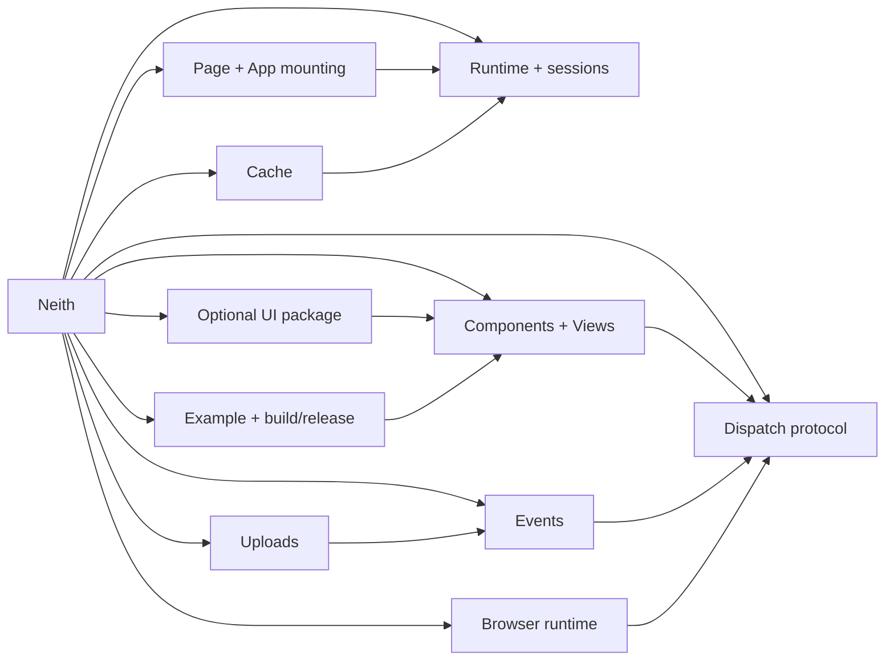

# Repository Map

This map describes the role of every tracked source/configuration/documentation/static file family in the Neith repository. Generated artifacts are identified so contributors know where behavior should actually be edited.

## Root package

| Path | Role |
| --- | --- |
| `README.md` | Public project introduction, installation, examples, API layers, and broad reference. |
| `LICENSE` | Repository license text. |
| `go.mod` | Canonical Go module identity (`github.com/seanbman/neith`), Go version, and Go dependencies. |
| `go.sum` | Go dependency integrity lock data. |
| `Makefile` | Developer commands for tests, example runs, templ generation, browser/style asset builds, debugging, coverage, and tag publication. |
| `.gitignore` | Repository ignore policy for local/build artifacts. |
| `tailwind.config.js` | Tailwind input/content configuration used by the style build. |
| `pkg.go` | Package documentation, global/default configuration, logging levels, upload/cache defaults, and `Config`/`SetConfig`. |
| `runtime.go` | Internal application runtime: handler, session, listener, cache-store, cache-event, and config ownership. |
| `context.go` | Context keys plus internal dispatch details linking handlers/components to runtime, client ID, connection, and handler ID. |
| `session.go` | Client-session registry and active-connection replacement/detach/cleanup semantics. |
| `conn.go` | Gorilla WebSocket upgrade, connection read/write loops, active-connection publishing, reconnect replacement, and delayed cache cleanup. |
| `handler.go` | Runtime handler pool; dispatch input/output channels; ping/event/render/class/DOM/redirect/custom/error routing; `MiddleWareFn`. |
| `dispatch.go` | WebSocket `Dispatch` envelope and dispatch-function identifiers; Go side of the wire contract. |
| `dispatch_payloads.go` | Payload structs for render, ping, class, DOM, redirect, custom JavaScript, and errors. |
| `component.go` | Core `Component` interface, `FnComponent`, render targeting, events, immediate dispatch, redirects/errors, class/DOM helpers, and raw HTML support. |
| `view.go` | High-level `View` wrapper and readable `ViewOption` event/target helpers. |
| `page.go` | Generated HTML shell, page options, `App`, and embedded browser/UI assets. |
| `event_listener.go` | Supported DOM event names, event-listener metadata, and runtime/client-scoped listener registry. |
| `event_types.go` | Exported JSON event target, upload, pointer, touch, drag, mouse, keyboard, and form payload structs. |
| `events.go` | Handler-side `EventData[T]`, `EventUploads`, `EventSubmitter`, and current-event lookup. |
| `upload.go` | Multipart upload endpoint, request/memory limits, secure file creation, upload metadata, and default upload directory. |
| `cache.go` | Generic per-client cache API, timeouts, history, callbacks, cache stores, and cache-event registry. |
| `errors.go` | Exported dispatch/context and cache error values. |
| `utils.go` | Small internal utility helpers used by the package. |

## Root Go tests

| Path | Contract under test |
| --- | --- |
| `cache_test.go` | Typed cache behavior, duplicate/wrong-type handling, persistence, expiry/history/callback logic, and isolation. |
| `component_test.go` | Component rendering and dispatch configuration, event metadata, render targets, and helper effects. |
| `conn_test.go` | Connection publication/lifecycle and active-session connection behavior. |
| `dispatch_test.go` | Dispatch initialization/shape and payload behavior. |
| `events_test.go` | Event payload decoding, upload metadata access, submitter behavior, and missing-event context. |
| `page_test.go` | Default/custom page rendering and embedded asset handling. |
| `runtime_test.go` | Runtime construction/configuration and separation. |
| `session_test.go` | Session attach/replace/detach/delete behavior. |
| `upload_test.go` | Multipart upload persistence, metadata, directory and size behavior. |
| `view_test.go` | `View` and `ViewOption` equivalence to lower-level `FnComponent` operations. |

## Optional Go UI package

| Path | Role |
| --- | --- |
| `ui/component.go` | Renderer-agnostic UI primitives and options: semantic layout, forms, inputs, select choices, tables, alerts, attributes/classes, escaping, and component rendering. |
| `ui/component_test.go` | Output/escaping/options/form/table coverage for the `ui` package. |

The `ui` package produces ordinary `neith.Component` values. It is optional and can be mixed with `templ` or custom components rather than defining a separate runtime.

## Browser runtime (`static/assets`)

| Path | Role |
| --- | --- |
| `static/assets/index.ts` | TypeScript bundle entrypoint; starts the browser runtime by constructing `Socket`. |
| `static/assets/socket.ts` | Same-route WebSocket URL, stable `localStorage` client key, API creation, lifecycle hooks, and reconnect backoff. |
| `static/assets/api.ts` | Incoming dispatch router; redirects, browser operations, response dispatches, and client error conversion. |
| `static/assets/render.ts` | Concrete DOM mutation functions for render/class/DOM/custom operations. |
| `static/assets/events.ts` | Listener metadata parsing, native event registration, event dispatch construction, and hook integration. |
| `static/assets/event_payloads.ts` | Serialization of DOM events/targets into JSON-safe payload shapes mirrored by Go types. |
| `static/assets/uploads.ts` | Form value extraction, submitter compatibility, file collection, multipart upload, and upload endpoint construction. |
| `static/assets/hooks.ts` | Hook registry and public `window.neith.on/off` lifecycle API. |
| `static/assets/neith_types.ts` | TypeScript declarations/enums for the Neith dispatch protocol and payloads. |
| `static/assets/custom.js` | Small browser-side custom-script fixture/example artifact. |
| `static/assets/neith-ui.css` | Neutral CSS shipped with Neith's optional UI primitives and embedded by `page.go`. |
| `static/assets/neith.min.js` | **Generated:** minified browser bundle built from `index.ts` and its imports; embedded by `page.go`. |
| `static/assets/package.json` | Browser-test/development package metadata and Jest/TypeScript dependencies. |
| `static/assets/tsconfig.json` | TypeScript compiler configuration. |
| `static/assets/jest.config.js` | Jest/ts-jest/jsdom test configuration. |
| `static/assets/tests/index.test.ts` | Browser integration suite covering WebSocket dispatch, DOM rendering, events, uploads, hooks, errors, and reconnection. |

## Style build inputs/outputs

| Path | Role |
| --- | --- |
| `static/assets/stylesheets/tailwind.css` | Tailwind source/input stylesheet. |
| `static/assets/stylesheets/tailwind.min.css` | **Generated:** minified Tailwind output. |
| `static/assets/sass/styles.sass` | Sass source placeholder/current Sass entry. |
| `static/assets/stylesheets/styles.css` | Sass/CSS output or placeholder stylesheet. |
| `static/assets/stylesheets/styles.css.map` | Generated source-map metadata for stylesheet output. |

The embedded neutral stylesheet is `neith-ui.css`; the Tailwind/Sass files are separate build surfaces.

## Static branding/application shell artifacts

| Path | Role |
| --- | --- |
| `static/logo.png` | Neith project logo used by the root README and static branding. |
| `static/icon.png` | Application/icon branding asset. |
| `static/favicon.ico` | Browser favicon asset. |
| `static/manifest.json` | Browser/PWA-style static manifest metadata. |
| `static/index.html` | Historical/static HTML shell artifact; the current Go `Page` implementation generates the normal Neith app shell programmatically. |
| `static/.comments/logo.png.xml` | Image-comment metadata sidecar for `logo.png`; currently contains empty caption/note/place/category fields. |

These assets are indexed because they are tracked repository artifacts, but only `neith.min.js` and `neith-ui.css` are embedded by the current `page.go` asset declaration.

## Runnable example

| Path | Role |
| --- | --- |
| `examples/readme-setup/README.md` | Example-specific setup/run explanation. |
| `examples/readme-setup/main.go` | Runnable HTTP application demonstrating Neith API usage. |
| `examples/readme-setup/dashboard.templ` | Source `templ` component for the example UI. |
| `examples/readme-setup/dashboard_templ.go` | **Generated:** Go output produced from `dashboard.templ`. |
| `examples/readme-setup/go.mod` | Isolated example module dependencies. |
| `examples/readme-setup/go.sum` | Example dependency integrity data. |
| `examples/readme-setup/static/example.css` | Example-only presentation stylesheet. |

The example module is intentionally separate enough to demonstrate how a consumer uses Neith rather than relying on unexported internals.

## Focused design/reference notes

| Path | Role |
| --- | --- |
| `notes/README.md` | Index/entry point for focused technical notes. |
| `notes/component/README.md` | Function-by-function `Component` / `FnComponent` reference and internal flow. |
| `notes/cache/README.md` | Function-by-function typed cache reference, timeout/history/callback semantics, and internal flow. |

## Editor configuration

| Path | Role |
| --- | --- |
| `.vscode/launch.json` | VS Code launch/debug configuration for local development. |
| `.vscode/settings.json` | Repository-local VS Code settings. |

## Documentation added for repository maintenance

| Path | Role |
| --- | --- |
| `docs/README.md` | Documentation navigation and source-of-truth guidance. |
| `docs/ARCHITECTURE.md` | Cross-runtime architecture and lifecycle reference. |
| `docs/USAGE.md` | Current usage guide from installation through production concerns. |
| `docs/BROWSER_CLIENT.md` | TypeScript browser runtime and protocol guide. |
| `docs/DEVELOPMENT.md` | Development, testing, generation, and release workflow. |
| `docs/REPOSITORY_MAP.md` | This file; tracked repository structure and ownership map. |

## Grapher artifacts

The Grapher index uses local `.grapher/knowledge.json` while being built. `grapher publish` creates the shareable form under `.grapher/shared/`. The shared graph is intended to be committed; mutable local/runtime state should not be treated as application source.

The Neith index includes both file nodes and higher-level semantic nodes for these subsystems:

Search these concepts in Grapher rather than relying only on filenames when onboarding or planning a change.